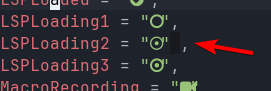
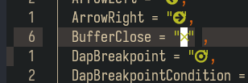

# Neovim utf8 fix for tmux / zellij / WSL

You may have seen [this](#examples) issue when using programs in your terminal that use [nerd-fonts](https://www.nerdfonts.com/) icons, this is due to the recent changes in [version 3.0.0](https://github.com/ryanoasis/nerd-fonts/releases/tag/v3.0.0) where the old codepoints for Material Design icons (which constitute a grand majority of nerd-fonts icons) got dropped and got completely moved to the 5 digit section.  
This issue seems to mostly happen for [tmux](https://github.com/tmux/tmux/wiki) and [zellij](https://zellij.dev/) user running them trough the Windows Subsystem for Linux.

## Fix

**NOTE:** This configuration was made specifically for [AstroNvim](https://astronvim.com/) users, but anyone with a decent understanding of Lua can adapt it to their own configuration (or distro).

1. Download this repository's files in your configuration  
   Here is an _untested_ bash command to do that directly:

```bash
ASTRO_CONF_LOC="${XDG_CONFIG_HOME:-$HOME/.config}/astronvim" # replace path here if different
curl -L https://github.com/TheSast/neovim-utf8-mux-fix/archive/HEAD.tar.gz | tar -z -x --strip-components=1 --exclude '*/img/*' --exclude '*.md' -C $ASTRO_CONF_LOC
```

2. Pass your icons table trough the fix function

If in `icons.lua`

```lua
return require("user.utf8mux").icons {
    -- your icons here
}
```

If in `init.lua`

```lua
return {
    icons = require("user.utf8mux").icons {
        -- your icons here
    }
}
```

3. Pass your mappings table trough the fix function

If in `mappings.lua`

```lua
return require("user.utf8mux").mappings {
    -- your mappings here
}
```

If in `init.lua`

```lua
return {
    mappings = require("user.utf8mux").mappings {
        -- your mappings here
    }
}
```

## Examples

  


## Related issues and PRs

### Relevant Plugins

<https://github.com/nvim-neo-tree/neo-tree.nvim/pull/921>  
<https://github.com/nvim-tree/nvim-web-devicons/pull/264>  
<https://github.com/onsails/lspkind.nvim/pull/64>

### Issue info

<https://github.com/ryanoasis/nerd-fonts/issues/1246>  
<https://github.com/microsoft/terminal/issues/15369>  
<https://github.com/microsoft/terminal/issues/8000>

### Fixes

<https://github.com/microsoft/terminal/releases/tag/v1.18.1421.0>  
<https://github.com/wez/wezterm/issues/3748>

---

Please open up a pr if you have anything you'd like to add, correct or update!

**IMPORTANT NOTE: This repository will be deleted in a few months when the issue becomes fixed in most terminals**
